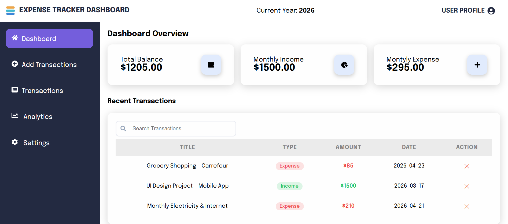

# 💰 Expense Tracker Dashboard

A professional, responsive financial management application built with **React**, **React Router**, and **Sass**. This project features a clean UI/UX design and uses local storage for data persistence.


_(Note: Replace this with the actual path to your screenshot after you upload it to GitHub)_

## 🚀 Features

- **Dashboard Overview**: Real-time calculation of Total Balance, Monthly Income, and Monthly Expenses.
- **Transaction Management**:
  - Add new transactions (Income/Expense).
  - Categorize and date-stamp financial activities.
  - Delete records with instant UI updates.
- **Multi-Page Architecture**: Seamless navigation using React Router without page refreshes.
- **Search Functionality**: Quickly find specific transactions by title.
- **Persistent Data**: Uses `localStorage` so your data remains even after closing the browser.
- **Professional UI**: Custom styled with Sass, featuring a dark-themed sidebar and high-contrast status cards.

## 🛠️ Tech Stack

- **Frontend**: React.js (Hooks, Functional Components)
- **Routing**: React Router DOM
- **Styling**: Sass (SCSS)
- **Icons**: React Icons
- **Build Tool**: Vite

## 📂 Project Structure

- `src/components`: Reusable UI components (Sidebar, Layout, Form, Lists).
- `src/pages`: Top-level page views (Dashboard, AddTransaction).
- `src/layout`: Global architectural components.
- `src/assets`: Images and global styles.

## ⚙️ Installation & Setup

1. **Clone the repository:**
   ```bash
   git clone https://github.com/faizullahhussain/expense-tracker.git
   ```
